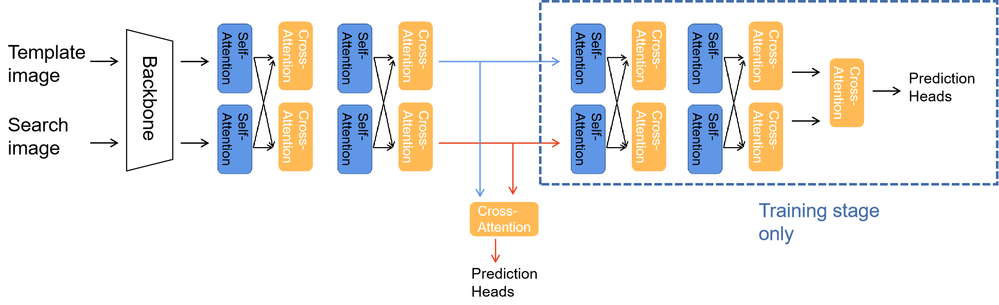
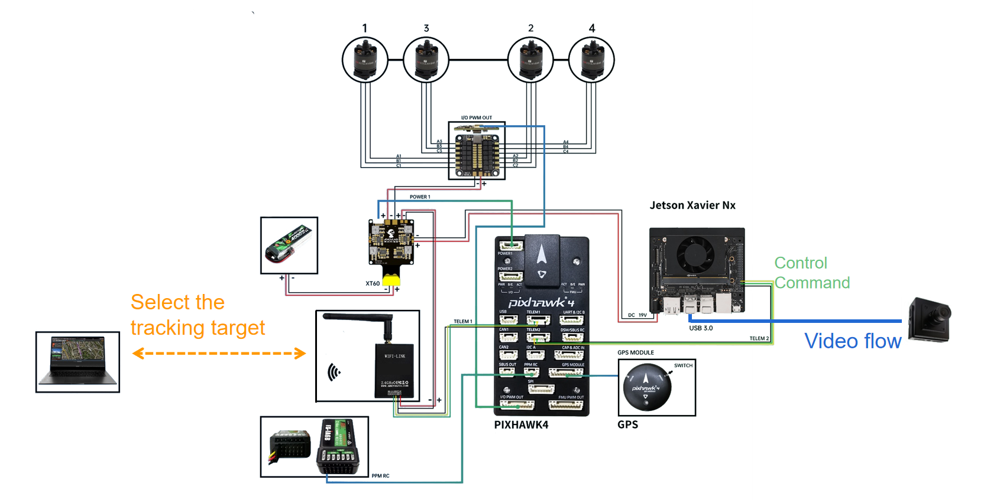

# Multi-source Templates Learning for Real-time Aerial Object Tracking

This is the official code for the paper "Multi-source Templates Learning for Real-time Aerial Object Tracking".In this work, we present an efficient Aerial Object Tracking method via Multi-source Templates named MSTL. 

## Highlights

### Real-Time Speed on edge platform.

Our tracker can run **~200fps on GPU, ~100fps on CPU, and ~20** on Nvidia Jetson Xavier NX platform. After tensorRT to accelerate, the speed can reach , **~60fps on  Jetson Xavier NX, ~19 fps on Jetson Nano**.

Opposing to previous aerial trackers which evaluate on high-end platform(like Jetson AGX/Orin Series), the proposed tracker can run on extremely cheap edge platform: Jetson Nano and  Jetson Xavier NX.

###  Competitive performance.

|         | Year      | Speed(fps) | UAV123(Prec.) | UAV123@10fpsUAV123(Prec.) | UAV20LUAV123(Prec.) |
| ------- | --------- | ---------- | ------------- | ------------------------- | ------------------- |
| Ours    |           | 209        | 82.35         | 83.50                     | 83.59               |
| TCTrack | CVPR 2022 | 128        | 80.05         | 77.39                     | 67.20               |
| HIFT    | ICCV 2021 | 137        | 78.70         | 74.87                     | 76.32               |


### Demo


## Quick Start

### Environment Preparing

```
python 3.7.3
pytorch 1.11.0
opencv-python 4.5.5.64
```

### Training

First, you need to set paths for training datasets in lib/train/admin/local.py.

Then, run the following commands for training.

```bash
python lib/train/run_training.py
```

### Evaluation

First, you need to set paths for this project in lib/test/evaluation/local.py.

 Then, run the following commands for evaluation on four datasets.

- UAV123

```bash
python tracking/test.py MSTL MSTL --dataset uav
```

- UAV20L

```bash
python tracking/test.py MSTL MSTL --dataset uavl
```

- UAV@10fps

```
python tracking/test.py MSTL MSTL --dataset uav10
```

- UAV -x

```
python tracking/test.py MSTL MSTL --dataset uavd
```


### Trained model and Row results

The trained models, the training logs, and the raw tracking results are provided in the [model zoo](MODEL_ZOO.md)


##  MSTL framework for other transformer-based trackers.
To use our framework for other transformer-based trackers,  we jointly trained the original
tracker with an additional prediction head. The head takes outputs of the transformer encoder(or transformer-based structure)
as inputs and predicts the bounding box of the target directly.

As an example, we use TransT(CVPR2021) with 4 feature integration layers (Each layer with 2 self-Attention and 2 Cross-Attention) to demonstrate how to implement the proposed decoupling strategy.

- During training:
  - Step 1: Feed the outputs of the second layers into an additional cross-attention mechanism to fuse the search and template features.
  - Step 2: Use the outputs of the cross-attention as input for prediction heads to locate the target.
  - Step 3: Train the original model together with the additional cross-attention layer and prediction heads.
- During inference:
  - We use the outputs of the second layer to locate the target.



| Tracker | Original Succ. (UAV123) | Original params | Succ. (After decoupling) | params(After decoupling) |
| ------- | ----------------------------- | --------------- | -------------------- | ------ |
| TransT  | 69.1                          | 23.0M           | -                    | 16.7M  |
| STARK-S | 68.35                  | 28.079M            | **68.55**      | 18.616M | 

For further information, we will make the corresponding codes and pre-trained models available.
 


## About the UAV platform

The platform mainly consists of four parts, i.e., a [Pixhawk](https://pixhawk.org/) flight controller, a Figure Number transmissions, a visual camera and a [Jetson Xavier NX](https://www.nvidia.com/en-us/autonomous-machines/embedded-systems/jetson-xavier-nx) onboard computer. The onboard computer can obtain the video flow through the USB port. The ground station computer can remotely access the onboard computer and select the target to be tracked through data transmission.





## Acknowledgement

-  Thanks for the [PyTracking](https://github.com/visionml/pytracking)  and [stark](https://github.com/researchmm/Stark) Library, which helps us to quickly implement our ideas. We would like to thank their authors for providing great frameworks and toolkits.

